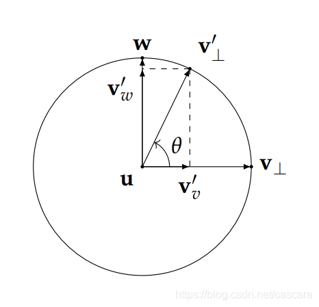

# 旋转矩阵与李群以及李代数的关系

## 1.旋转矩阵的性质

设坐标点$p$ 在当前正交基$e=（e_1,e_2,e_3）$下的坐标为$(x,y,z)$，该正交基经过旋转后在新的坐标基$e'=（e'_1,e'_2,e'_3）$下坐标为$(x',y',z')$。则有：

$$

\begin{array}{ccr}
\begin{bmatrix}
e_1 & e_2 & e_3
\end{bmatrix}
\begin{bmatrix}
x \\ y \\ z
\end{bmatrix} 
=
\begin{bmatrix}
e'_1 & e'_2 & e'_3
\end{bmatrix}
\begin{bmatrix}
x' \\ y' \\ z'
\end{bmatrix} & (1) \\
\begin{bmatrix}
e^T_1 \\ e^T_2 \\ e^T_3
\end{bmatrix}
\begin{bmatrix}
e_1 & e_2 & e_3
\end{bmatrix}
\begin{bmatrix}
x \\ y \\ z
\end{bmatrix} 
=
\begin{bmatrix}
e^T_1 \\ e^T_2 \\ e^T_3
\end{bmatrix}
\begin{bmatrix}
e'_1 & e'_2 & e'_3
\end{bmatrix}
\begin{bmatrix}
x' \\ y' \\ z'
\end{bmatrix}  & (2) \\
\begin{bmatrix}
{e^T_1}{e_1} & {e^T_1}{e_2} & {e^T_1}{e_3} \\
{e^T_2}{e_1} & {e^T_2}{e_2} & {e^T_2}{e_3} \\
{e^T_3}{e_1} & {e^T_3}{e_2} & {e^T_3}{e_3} \\
\end{bmatrix}
\begin{bmatrix}
x \\ y \\ z
\end{bmatrix}  = 
\begin{bmatrix}
{e^T_1}{e'_1} & {e^T_1}{e'_2} & {e^T_1}{e'_3} \\
{e^T_2}{e'_1} & {e^T_2}{e'_2} & {e^T_2}{e'_3} \\
{e^T_3}{e'_1} & {e^T_3}{e'_2} & {e^T_3}{e'_3} \\
\end{bmatrix}
\begin{bmatrix}
x' \\ y' \\ z'
\end{bmatrix}  & (3)  \\
由e_xe_y|_{x \ne y} = 0 且e_x为单位向量可知\\
\begin{bmatrix}
x \\ y \\ z
\end{bmatrix}  = 
\begin{bmatrix}
{e^T_1}{e'_1} & {e^T_1}{e'_2} & {e^T_1}{e'_3} \\
{e^T_2}{e'_1} & {e^T_2}{e'_2} & {e^T_2}{e'_3} \\
{e^T_3}{e'_1} & {e^T_3}{e'_2} & {e^T_3}{e'_3} \\
\end{bmatrix}
\begin{bmatrix}
x' \\ y' \\ z'
\end{bmatrix} \stackrel{def}{=} Rp'
\end{array}
$$

其中$R$定义为旋转矩阵，因为都为单为向量，长度都为1，所以也叫方向余弦矩阵。也叫特殊正交群$SO(3)$

1. 旋转矩阵是正交阵（旋转不改变向量的性质，因此原来的基经过旋转，依然保持两两正交），其向量两两正交。根据正交性质可以得出 $A^{-1} = A^T$

## 2.变换矩阵

变换矩阵$T$为旋转矩阵+平移向量，并转换成齐次形式。也叫特殊欧式群$SE(3)$

$$
\begin{array}{cl}
p' & = Rp + t \\
\begin{bmatrix}
p' \\ 1
\end{bmatrix}
 & = 
\begin{bmatrix}
R & t \\
0 & 1
\end{bmatrix}
\begin{bmatrix}
p \\ 1
\end{bmatrix} \\
p' & \stackrel{def}{=} Tp
\end{array} \tag{4}
$$

1. 变换矩阵的逆$T^{-1}$

$$
T^{-1} = 
\begin{bmatrix}
R^T & -R^Tt \\
0^T & 1
\end{bmatrix} \tag{5}
$$

## 3. 旋转矩阵与旋转向量的关系

由于旋转矩阵冗余的表达关系（9个量只有3个量有用），同样变换矩阵有16分量只有6个量有用，因此可以转换成旋转向量来进行表示。

转换公式主要基于[罗德里格公式](https://zhuanlan.zhihu.com/p/451579313)
$$
R = \cos \theta I +(1-\cos \theta)nn^T + \sin \theta \hat n \tag{6}
$$
其中$\hat n $为$n$的反对称矩阵，有 $ -\hat n = \hat n ^T$。$n$为单位旋转向量$(x,y,z)$，$\theta$为旋转角度。
$$
\begin{array}{rl}
n & = [x,y,z] \\
\hat n & = \begin{bmatrix}
0 & -z & y \\ 
z & 0 & -x \\
-y & x & 0 \\
\end{bmatrix}
\end{array} \tag{7}
$$
对$(6)$式两边求迹，有旋转角的大小$\theta$为:
$$
\begin{array}{cl}
R = & 
\begin{bmatrix}
\cos \theta & 0 & 0 \\
0 & \cos \theta  & 0 \\
0 & 0 & \cos \theta  \\
\end{bmatrix} + (1-\cos \theta) \begin{bmatrix} x\\y\\z \end{bmatrix} \begin{bmatrix} x & y & z \end{bmatrix}  + \sin \theta \begin{bmatrix}
0 & -z & y \\ 
z & 0 & -x \\
-y & x & 0 \\
\end{bmatrix} \\
R = &
\begin{bmatrix}
\cos \theta & 0 & 0 \\
0 & \cos \theta  & 0 \\
0 & 0 & \cos \theta  \\
\end{bmatrix} + 
\begin{bmatrix}
(1- \cos \theta)xx & (1- \cos \theta)xy & (1- \cos \theta)xz \\
(1- \cos \theta)yz & (1- \cos \theta)yy  & (1- \cos \theta)yz \\
(1- \cos \theta)zx & (1- \cos \theta)zy & (1- \cos \theta) zz  \\
\end{bmatrix} +
\begin{bmatrix}
0 & -z\sin \theta & y\sin \theta \\ 
z\sin \theta & 0 & -x\sin \theta \\
-y\sin \theta & x\sin \theta & 0 \\
\end{bmatrix} \\
tr(R) = & 3 \cos \theta + (1-\cos \theta)(x^2 + y^2 + z^2) + 0 \\
tr(R) = & 3 \cos \theta + 1-\cos \theta = 1 + 2  \cos \theta \\
\theta = & \arccos {{tr(R) - 1} \over 2}
\end{array} \tag{8}
$$
根据旋转轴在旋转后方向不变的性质可得，$Rn = n$。即$n$为旋转矩阵$R$特征值为1的特征向量。

##  4. 旋转矩阵和旋转向量之间的转换关系

旋转矩阵$R$与旋转向量$\theta n$的关系

### 1. 旋转向量转换成旋转矩阵

**罗德里格公式:**
$$
R = \cos \theta I +(1-\cos \theta)nn^T + \sin \theta \hat n
$$

### 2. 旋转矩阵转换成旋转向量

$$
\begin{array}{cl}
\theta = &  \arccos {{tr(R) - 1} \over 2} \\
n = & Rn ，对R求特征值为1的特征向量
\end{array}
$$

## 5.欧拉角

​	欧拉角使用三个轴的旋转角来描述旋转，但是会有万向锁的问题：即对于一个三轴旋转$(x,y,z)$，在绕$x$轴旋转$\alpha$后，绕$y$轴旋转$90\degree$，最后绕$z$轴旋转$\theta$时本质上和绕$x$轴旋转一样。也就是奇异性问题（周期性问题，转$180\degree$还是回到原样）。唯一好处是直观。

## 6.四元数

四元数本质上还是旋转向量和旋转角的结合，只是把旋转向量投射到了复数域。
$$
\left \{
\begin{array}{l}
q = q_0 + q_1 i + q_2j + q_3k \\
i^2 = j^2 = k^2 = -1 \\
ij = k,ji = -k \\
ki = j,ik = -j \\
jk = i,kj = -i \\
\end{array}
\right.
$$
其中$q_0$为实数，$q_1,q_2,q_3$为虚数，取虚部即为旋转向量。

### 6.1 四元数的运算性质

$$
q_a = s_a + x_ai + y_aj + z_ak \stackrel{记}{=}[s_a,v_a] \\
q_b = s_b + x_bi + y_bj + z_bk \stackrel{记}{=}[s_b,v_b]
$$

#### 1.加法

$$
q_a + q_b = (s_a + s_b) + (x_a+x_b)i + (y_a + y_b)j + (z_a + z_b) \stackrel{记}{=}[s_a+s_b,v_a+v_b]
$$

#### 2.乘法

$$
\begin{array}{rl}
q_aq_b =& (s_a + x_ai + y_aj + z_ak)(s_b + x_bi + y_bj + z_bk) \\
=& s_as_b + s_a x_bi + s_a y_bj + s_az_bk + \\
& s_bx_ai + x_ax_bi^2 + x_ay_b ij + x_az_bik + \\
& s_by_aj + y_ax_bji + y_ay_b j^2 + y_az_bjk + \\
& z_as_bk+ z_ax_bki + z_ay_bkj + z_az_bk^2 \\
= & (s_as_b - x_ax_b-y_ay_b - z_az_b) + \\
& (s_ax_b + s_bx_a + y_az_b - z_ay_b) i + \\
& (s_ay_b + s_by_a + z_ax_b - x_az_b)j + \\
& (s_az_b + s_bz_a +x_ay_b - y_ax_b )k \\
[s_a,v_a][s_b,v_b] =& [s_as_b-v_a^Tv_b,s_av_b+s_bv_a+v_a\times v_b]
\end{array}
$$

#### 3.模长

$$
||q_a|| = \sqrt{s_a^2 + x_a^2+y_a^2 + z_a^2} \\
||q_aq_b|| = ||q_a|| ||q_b||
$$

#### 4. 共轭

实部相同，虚部相反为共轭
$$
q_a^\star = [s_a,-v_a]
$$
共轭的性质有如下：
$$
\begin{array}{rl}
q^\star q = q q^\star = & (s-xi-yj-zk)(s+xi+yj+zk) \\
= & s^2 + sxi +syj +szk \\
& -sxi - (xi)^2 -xyij - xzik \\
& -syj - xyji - (yj)^2 - yzjk \\
& -zsk - zxki - zykj - (zk)^2 \\
= & s^2 + x^2 + y^2 + z^2 - xyk + xzj  + xyk -yzi -xzj + zyi \\
= & s^2 + x^2 + y^2 + z^2  \\
= & [s^2+v^tv,0]
\end{array}
$$

#### 5. 逆

$$
q^{-1} = {q^\star \over ||q||^2} = {[s_a,-v_a] \over s_a^2 + x_a^2 + y_a^2 + z_a^2}
$$

逆的性质如下：
$$
\begin{array}{rl}
qq^{-1} = q^{-1}q = & q^\star q \over ||q||^2 \\
= & {[s^2 + v^tv,0] \over s^2+v^tv} = [\mathbf 1,0]
\end{array}
$$

$$
\begin{array}{rl}
(q_aq_b)^{-1} =& [s_as_b-v_a^Tv_b,s_av_b+s_bv_a+v_a\times v_b]^{-1} \\
= & {[s_as_b - v_a^Tv_b,-(s_av_b + s_bv_a + v_a \times v_b)] \over (s_as_b - v_a^Tv_b)^2 + (s_av_b + s_bv_a + v_a \times v_b)^2 } \\
q_b^{-1}q_a^{-1} = & {q_b^\star q_a^\star \over ||q_b||^2 ||q_a||^2 } = {q_b^\star q_a^\star \over ||q_bq_a||^2} \\
= & {[s_b,-v_b][s_a,-v_a] \over ||q_aq_b||^2} = {[s_as_b - (-v_b^T)(-v_a),s_b(-v_a) + s_a(-v_b) + (-v_b) \times (-v_a)] \over ||q_aq_b||^2} \\
= &  {[s_as_b - v_b^Tv_a,-s_bv_a - s_av_b - v_a \times v_b] \over ||q_aq_b||^2} \\
其中:& (-v_b)\times (-v_a) = -v_a \times v_b ，几何上需要添加符号反向\\
\begin{bmatrix}
0 & z_b & -y_b \\
-z_b & 0 & x_b \\
y_b & -x_b & 0 \\
\end{bmatrix}\begin{bmatrix}
-x_a \\ -y_a \\ -z_a
\end{bmatrix} =& \begin{bmatrix}
z_ay_b-z_by_a \\
x_az_b-x_bz_a \\
x_by_a - x_ay_b
\end{bmatrix} = 
\begin{bmatrix}
0 & z_a & -y_a \\
-z_a & 0 & x_a \\
y_a & -x_a & 0 \\
\end{bmatrix}\begin{bmatrix}
x_b \\ y_b \\ z_a
\end{bmatrix}
\end{array}
$$

#### 6.数乘

$$
kq = [ks_a,kv_a]
$$

### 6.2 使用四元数表示旋转

空间中的点使用四元数表示为$p = [0,x,y,z]$经过一个单位四元数$q = [0,x_q,y_a,z_q]$表示的旋转之后所得到的坐标点$p'$ 有如下式子成立：
$$
p' = qpq^{-1}
$$
证明：

$$
\begin{array}{rl}
设:& 旋转轴为i,旋转角为\theta\\
p = &p_{\bot} + p_{||} \\
p' = & p'_{\bot} + p'_{||} \\
p'_{||} =& p_{||} = \cos \alpha |p| i = {|p||i|\cos \alpha \over |i|} i = (pi)i \\
p_{\bot} =& p - p_{||} = p-(pi)i \\
如上图所示:& \\
p'_{\bot} = & p_{\bot} \cos \theta + w\sin \theta = p_{\bot} \cos \theta +(i \times p_{\bot}) \sin \theta \\
p' =& (pi)i + (p-(pi)i) \cos \theta + ( i \times (p-(pi)i) ) \sin \theta \\
= & (pi)i(1-\cos \theta) + p \cos\theta + (i \times p- i \times (pi)i ) \sin\theta ,其中i\times i = 0 \\
= & p \cos\theta +(1-\cos \theta)(pi)i + i \times p  \sin\theta \\

\end{array}
$$

同理在四维复平面中有:
$$
\begin{array}{rl}
p = & [0,x,y,z] = [0,v] \\
p_{\bot} = & [0,v_{\bot}] \\
p'= & [0,v'] \\
u =& [0,u] \\
p'_{\bot} =& p_{\bot} \cos \theta + w\sin \theta \\
w = & [0,u \times v_{\bot}] = [0,u][0,v_{\bot}] = [- u \cdot v_{\bot},u \times v_{\bot}] =up_{\bot} \ \ 其中v_{\bot}与u垂直，因此有v_{\bot}\cdot u = 0|_{\cos 90\degree = 0} \\
p'_{\bot} = & p_{\bot} \cos \theta + u p_{\bot}\sin \theta = (\cos \theta  + u\sin\theta) p_{\bot} \\
p' =& p'_{\bot} + p'_{||} = (\cos \theta  + u\sin\theta) p_{\bot} +p_{||} \\
令:& (\cos \theta  + u\sin\theta) = q,qq = [\cos \theta,u\sin \theta][\cos \theta,u\sin \theta]=[\cos 2\theta,u\sin2\theta] \\
p' =& q p_{\bot} + p_{||} =q^{\theta \over 2}q^{\theta \over 2} p_{\bot} + q^{\theta \over 2}q^{{\theta \over 2}*} p_{||} \\
设:& 对于任意四元素w[\alpha ,\beta u] 有：\\
p_{\bot}w = & [0,v_{\bot}][\alpha,\beta u] = [-v_{\bot}\cdot \beta u, \alpha v_{\bot} + v_{\bot}\times u \beta] = [0,\alpha v_{\bot} + v_{\bot}\times u \beta] \\
w^*p_{\bot} =& [\alpha ,-\beta u][0,v_{\bot}] =[-\beta u \cdot v_{\bot},\alpha v_{\bot} -\beta u \times v_{\bot}] =[0,\alpha v_{\bot} -\beta u \times v_{\bot}] = p_{\bot}w \\
p_{||}w = & [0,v_{||}][\alpha,\beta u] = [-v_{||}\beta u,\alpha v_{||} + v_{||} \times \beta u] = [-v_{||}\beta u,\alpha v_{||}]_{其中v_{||} 平行于u} =wp_{||} \\

p'= & q^{\theta \over 2} p_{\bot} q^{{\theta \over 2}*}+ q^{\theta \over 2} p_{||} q^{{\theta \over 2}*} = q^{\theta \over 2}(p_{\bot}+p_{||})q^{{\theta \over 2}*} = qpq^{-1}\\

\end{array} \tag{8}
$$
注意：根据右手定则$w = u\times v_{\bot}$ 

### 6.3 四元数与其他旋转的转换

定义两个$4\times 4$的矩阵$q^+,q^{\oplus}$，其中$v = [x,y,z]^T$
$$
q^+ = 
\begin{bmatrix}
s & -v^T \\
v & sI+\hat v\\
\end{bmatrix} \\
q^{\oplus} = 
\begin{bmatrix}
s & -v^T \\
v & sI- \hat v\\
\end{bmatrix} \\ 其中
\hat v = 
\begin{bmatrix}
0 & -z & y \\
z & 0 & -x \\
-y & x & 0 \\
\end{bmatrix} 见式子(7)
$$
对于$q_x = [s_x,v_x]^T$有如下计算性质：
$$
\begin{array}{rl}
q^+q_x =& 
\begin{bmatrix}
s & -v^T \\
v & sI +  \hat v
\end{bmatrix}
\begin{bmatrix}
s_x \\
v_x
\end{bmatrix} = 
\begin{bmatrix}
ss_x-v^Tv_x \\
s_xv + (sI+\hat v)v_x
\end{bmatrix}\\
其中:& s_xv + (sI+\hat v)v_x= s_xv + sv_x + \hat vv_x \\
\hat v v_x = & \begin{bmatrix}
0 & -z & y \\
z & 0 & -x \\
-y & x & 0 \\
\end{bmatrix}
\begin{bmatrix}
x_{q_x} \\
y_{q_x} \\
z_{q_x} \\
\end{bmatrix} = \begin{bmatrix}
yz_{q_x} -zy_{q_x} \\
zx_{q_x} -xz_{q_x} \\
xy_{q_x} -yx_{q_x} \\
\end{bmatrix} = \begin{vmatrix}
i & j & k \\
x & y & z \\
x_{q_x} & y_{q_x} & z_{q_x} \\
\end{vmatrix} = v \times v_x \\
所以有:& 
q^+q_x = \begin{bmatrix}
ss_x-v^Tv_x \\
s_xv + sv_x+v \times v_x  \\
\end{bmatrix}= qq_x \\
q_x^{\oplus}q = & \begin{bmatrix}
s_x & -v_x^T\\
v_x & s_xI - \hat v_x \\
\end{bmatrix}\begin{bmatrix}
s \\
v \\
\end{bmatrix} = \begin{bmatrix}
s_xs-v_x^Tv \\
sv_x + (s_xI-\hat v_x) v \\
\end{bmatrix} \\
其中:& sv_x^T +(s_xI-\hat v_x) v =sv_x^T + s_xv - \hat v_x v \\
\hat v_xv =& \begin{bmatrix}
0 & -z_{q_x} & y_{q_x} \\
z_{q_x} & 0 & -x_{q_x} \\
-y_{q_x} & x_{q_x} & 0 \\
\end{bmatrix}\begin{bmatrix}
x \\
y \\
z \\
\end{bmatrix} = \begin{bmatrix}
zy_{q_x} - yz_{q_x} \\
xz_{q_x} - zx_{q_x} \\
yx_{q_x} - xy_{q_x} \\
\end{bmatrix} = - v \times v_x \\
综上:&
q^+q_x =qq_x = q_x^{\oplus}q ,一般的 q_1 q_2=q_1^+q_2 = q_2^{\oplus}q_1
\end{array}
$$
根据上式：$p' = qpq^{-1}$ 有如下推导：
$$
\begin{array}{rl}
p' =& qpq^{-1} = q^+pq^{-1} = q^+(q^{-1})^{\oplus}p  \stackrel{def}{=} Rp\\
q =& [s,v]\\
q^+ = &\begin{bmatrix}
s & -v^T \\
v & sI+\hat v
\end{bmatrix} \\
q^{-1} =& {[s,-v] \over |q|} = [s,-v] \\
(q^{-1})^{\oplus} =& \begin{bmatrix}
s & v^T \\
-v & sI +\hat v
\end{bmatrix}\\
R =& \begin{bmatrix}
s & -v^T \\
v & sI+\hat v
\end{bmatrix}
\begin{bmatrix}
s & v^T \\
-v & sI +\hat v
\end{bmatrix} = \begin{bmatrix}
s^2 + v^Tv & sv^T-v^T(sI +\hat v) \\
sv -(sI+\hat v)v & v v^T + (sI + \hat v)^2
\end{bmatrix} = \begin{bmatrix}
1 &-v^T\hat v \\
-\hat v v & v v^T +(sI+\hat v)^2
\end{bmatrix}\\
因:& \\
v^T\hat v =& \begin{bmatrix}
x & y & z
\end{bmatrix}\begin{bmatrix}
0 & -z & y \\
z & 0 & -x \\
-y & x & 0 \\
\end{bmatrix} = \begin{bmatrix}
0 & 0 & 0 \\
\end{bmatrix}\\
\hat vv = &\begin{bmatrix}
0 & -z & y \\
z & 0 & -x \\
-y & x & 0 \\
\end{bmatrix}\begin{bmatrix}
x\\
y\\
z\\
\end{bmatrix}  = \begin{bmatrix}
0 \\
0 \\
0 \\
\end{bmatrix}\\
有:& \\
R =& \begin{bmatrix}
1 & \mathbf 0 \\
\mathbf 0 & v v^T +s^2I + 2s\hat v +\hat v \hat v
\end{bmatrix}\\
\end{array}
$$
则四元数到旋转矩阵的变换如下所示：
$$
\begin{array}{rl}
R = & vv^T +s^2I + 2s\hat v +\hat v \hat v \\
=& \begin{bmatrix} x \\ y \\z \end{bmatrix}\begin{bmatrix}x & y & z\end{bmatrix} +
\begin{bmatrix}s^2 & 0 & 0 \\ 0 & s^2 & 0 \\0 & 0 & s^2 \end{bmatrix} + 
\begin{bmatrix}0 & -2sz & 2sy \\2sz & 0 & -2sx \\ -2sy & 2sx & 0 \end{bmatrix} +
\begin{bmatrix}-z^2-y^2 & xy & xz \\ xy & -z^2-x^2 & yz \\ xz & yz & -y^2-x^2 \end{bmatrix} \\
tr(R) = & x^2+y^2+z^2 + 3s^2 -2z^2 -2y^2 -2x^2 = 3s^2-x^2-y^2-z^2 = 4s^2 - 1 \\
由式(8):&
4s^2-1 = 1 + 2  \cos \theta \\
\cos \theta =& 2s^2 -1 = 2 \cos^2 {\theta \over 2} -1 \\
s =& \cos {\theta \over 2} \Rightarrow \theta = 2\arccos s \\
\end{array}
$$
因为四元数为单位四元数有：
$$
\begin{array}{rl}
q = &[s,v] 其中：s^2+v^2 = 1 \\
v\cdot v =& 1-s^2 = 1-\cos^2 {\theta \over 2} = \sin ^2 {\theta \over 2} \\
\end{array}
$$
所以旋转轴为虚数部分即可，但是要除以虚数的模长进行归一化。使其成为单位向量:
$$
[n_x,n_y,n_z] = [x,y,z]/ \sqrt{1-s^2} = [x,y,z]/\sin {\theta \over 2}
$$
综上：对于四元数表示的旋转$q = [s,x,y,z]$转换成旋转轴和旋转角有如下关系：

旋转矩阵$R$:
$$
R = vv^T +s^2I + 2s\hat v +\hat v \hat v \tag{9}
$$
旋转角$\theta$:
$$
\theta = 2\arccos s \tag{10}
$$

旋转轴$n = [n_x,n_y,n_z]$:
$$
n = [x,y,z]/\sin {\theta \over 2} \tag{11}
$$

## 7.三种变换（相似、仿射、射影）

### 7.1 相似变换

相似变换矩阵表达式如下:
$$
T_s= 
\begin{bmatrix}
sR & t\\
\mathbf 0^T & 1 \\
\end{bmatrix}
$$
$s$为旋转矩阵的缩放因子，在进行旋转后所有的点均按照系数$s$进行缩放。

### 7.2 仿射变换

仿射变换矩阵表达式如下:
$$
T_A = \begin{bmatrix}
A & t\\
\mathbf 0^T & 1\\
\end{bmatrix}
$$
其中$A$为可逆矩阵，不必为正交矩阵。

### 7.3 射影变换

$$
T_P = \begin{bmatrix}
A & t\\
a^T & v \\
\end{bmatrix}
$$

$A$为可逆矩阵，相机模型即为射影变换模型

## 8. 李群与李代数

### 8.1 李群

群使用一组元素集合与计算规则来表示，简单来说如果对于集合中的任一元素通过计算规则计算后依然属于该集合那么就可以成为群。

从群的角度具体而言需要满足四个条件，对于集合$A$ 运算$\cdot$而言有如下性质：

1. 封闭性:对于任意$\forall a_1,a_2 \in A ,a_1 \cdot a_2 \in A$
2. 结合律: $\forall a_1,a_2,a_3 \in A,(a_1 \cdot a_2) \cdot a_3 = a_1 \cdot (a_2 \cdot a_3)$
3. 幺元: $\exist a_0 \in A,\forall a \in A,a_0 \cdot a = a\cdot a_0 = a$
4. 逆:$\forall a \in A,\exist a^{-1} \in A,a \cdot a^{-1} = a_0$

所综上有，旋转矩阵和变换矩阵均与矩阵乘法构成群。

李群是指具有**连续性质**的群，例如整数与加法就不是李群。整数在实数域是离散的。

### 8.2 李代数

李代数表示的是李群局部性质，即局部的正切性质

李代数需要满足如下四个性质，对于集合$\Bbb V$ 数域$\Bbb F$ 以及二元运算符$[,]$又称李括号 有如下条件：

1. 封闭性：对于任意元素$\forall X,Y \in \Bbb V$，经过二元运算后$[X,Y] \in \Bbb V$仍属于集合$\Bbb V$  
2. 双线性: 简单来说线性运算可以作为系数单独提出来。$\forall X,Y,Z \in \Bbb V,a,b \in \Bbb F,[aX+bY,Z] = a[X,Z]+b[Y,Z];[Z,aX+bY] = a[Z,X] + b[Z,Y]$
3. 自反性:对于任意$\forall X \in \Bbb V,[X,X] = \mathbf 0$ 
4. 雅可比等价:对于任意$\forall X,Y,Z \in \Bbb V，有[X,[Y,Z]] + [Y,[Z,X]] + [Z,[X,Y]] = \mathbf 0$

### 8.3 李群和李代数之间的联系推导

在旋转运动中，$R$为关于时间$t$的函数，对于将旋转矩阵的最优解问题必然会涉及到对$R$求关于时间$t$的导数。所以有：

对于旋转矩阵$R$，已知其为正交阵，并且属于特殊正交阵，记$SO(3)$，并且有$RR^T = I$
$$
\begin{array}{rl}
R(t)R(t)^T =& I \\
\frac{dR(t)R(t)^T}{dt} =& \frac{dI}{dt} \\
\dot R(t)R(t)^T + R(t)\dot R(t)^T =& 0 \\
\dot R(t)R(t)^T =& - R(t)\dot R(t)^T = -(\dot R(t)R(t)^T)^T\\
\end{array}
$$
因此可以得出 $\dot R(t)R(t)^T$ 其实是一个反对称矩阵

根据反对称矩阵的性质可以找到一个向量来表示$\phi$。该矩阵通过$\hat \phi$变换可以得到。见式子$(7)$
$$
\begin{array}{rl}
\hat \phi(t) =& \dot R(t)R(t)^T \\
\hat \phi(t) R(t) =& \dot R(t) R(t)^T R(t) = \dot R(t) \\
& 将R(t)使用在t_0处泰勒展开: \\
R(t) =& R(t_0) + \dot R(t_0)(t-t_0) + {\ddot{R}(t_0) \over 2!}(t-t_0)^2 + \Delta \\
当t_0 = 0时有:& R(0) = I ,\dot{R}(0) = \hat \phi(0)R(0) = \hat \phi(0) \\
\dot R(t) = &\hat \phi(t) R(t)  = \hat \phi(0)R(t) \\
解微分方程:& \frac{dR(t)}{dt} = \hat \phi(0)R(t) \\
移项:& {1 \over R(t)} dR(t) = \hat \phi(0) dt \\
两边分别求积分:& \int{1 \over R(t)} dR(t) = \int \hat \phi(0) dt \\
ln(R(t)) =& \hat \phi (0) t + C \\
R(t) = & \exp(\hat \phi (0) t + C) = C\exp(\hat \phi (0) t) ,又:R(0) = I，有C = I \\
所以有:& R(t) = \exp(\hat \phi (0) t) \tag{12}
\end{array}
$$
则根据上式不难看出旋转矩阵函数可以根据在0域附近的导数求得。

在这里$\phi$ 实际上就是一种李代数。我们定义李括号为$[\phi_1,\phi_2] = \check{(\Phi_1\Phi_2-\Phi_2\Phi_1)}$。其中$\check{x}$表示根据反对称性质将矩阵转换成向量。这里$\Phi_x \in \Bbb R^3,\Phi_x = \hat \phi$
$$
\begin{array}{rl}
\check{n} =& \begin{bmatrix}
0 & -z & y \\
z & 0 & -x \\
-y & x & 0 \\
\end{bmatrix}  \Rightarrow [x,y,z] \\
\Phi =\hat n =& [x,y,z] \Rightarrow \begin{bmatrix}
0 & -z & y \\
z & 0 & -x \\
-y & x & 0 \\
\end{bmatrix} \\
\end{array}
$$
### 8.4 李代数性质证明

验证封闭性：
$$
\begin{array}{rl}
\phi_1 =& [x_1,y_1,z_1]\\
\phi_2 =& [x_2,y_2,z_2]\\
[\phi_1,\phi_2] =& \check{(\Phi_1\Phi_2-\Phi_2\Phi_1)} \\
 (\Phi_1\Phi_2-\Phi_2\Phi_1) = & \begin{bmatrix}
0 & -z_1 & y_1 \\
z_1 & 0 & -x_1 \\
-y_1 & x_1 & 0 \\
\end{bmatrix}\begin{bmatrix}
0 & -z_2 & y_2 \\
z_2 & 0 & -x_2 \\
-y_2 & x_2 & 0 \\
\end{bmatrix} - \begin{bmatrix}
0 & -z_2 & y_2 \\
z_2 & 0 & -x_2 \\
-y_2 & x_2 & 0 \\
\end{bmatrix}\begin{bmatrix}
0 & -z_1 & y_1 \\
z_1 & 0 & -x_1 \\
-y_1 & x_1 & 0 \\
\end{bmatrix} \\
= & \begin{bmatrix}
-z_1z_2 - y_1y_2 & y_1x_2 & z_1x_2 \\
x_1y_2 & -z_1z_2-x_1x_2 & z_1y_2 \\
x_1z_2 & y_1z_2 & -y_1y_2-x_1x_2
\end{bmatrix} - \begin{bmatrix}
-z_1z_2 - y_1y_2 & x_1y_2 & x_1z_2 \\
y_1x_2 & -z_1z_2-x_1x_2 & y_1z_2 \\
z_1x_2 & z_1y_2 & -y_1y_2-x_1x_2
\end{bmatrix} \\
=& \begin{bmatrix}
0 & y_1x_2 - x_1y_2 & z_1x_2-x_1z_2\\
x_1y_2-y_1x_2 & 0 & z_1y_2 - y_1z_2\\
x_1z_2 - z_1x_2 & y_1z_2 - z_1y_2 & 0\\
\end{bmatrix} \\
[\phi_1,\phi_2] = & \check{(\Phi_1\Phi_2-\Phi_2\Phi_1)} =\begin{bmatrix}y_1z_2 - z_1y_2 & z_1x_2-x_1z_2 & x_1y_2-y_1x_2\end{bmatrix}
\end{array}
$$
验证双线性:
$$
\begin{array}{rl}
[a\phi_1+b\phi_2,\phi_3] =& a[\phi_1,\phi_3]+b[\phi_2,\phi_3] \\
a\phi_1+b\phi_2 =& [ax_1+bx_2,ay_1+by_2,az_1+bz_2]\\
\phi_3 = & [x_3,y_3,z_3] \\
[a\phi_1+b\phi_2,\phi_3] =& \begin{bmatrix}(ay_1+by_2)z_3 - (az_1+bz_2)y_3 & (az_1+bz_2)x_3 - (ax_1+bx_2)z_3 & (ax_1+bx_2)y_3 - (ay_1+by_2)x_3 \end{bmatrix} \\
a[\phi_1,\phi_3] =& \begin{bmatrix}a(y_1z_3 - z_1y_3) & a(z_1x_3-x_1z_3) & a(x_1y_3-y_1x_3)\end{bmatrix} \\
b[\phi_2,\phi_3] =& \begin{bmatrix}b(y_2z_3 - z_2y_3) & b(z_2x_3-x_2z_3) & b(x_2y_3-y_2x_3)\end{bmatrix} \\
得:& [a\phi_1+b\phi_2,\phi_3] = a[\phi_1,\phi_3] + b[\phi_2,\phi_3] \\
[\phi_3,a\phi_1+b\phi_2] = & a[\phi_3,\phi_1] + b[\phi_3,\phi_2] \\
[\phi_3,a\phi_1+b\phi_2] = & \begin{bmatrix}y_3(az_1+bz_2) - z_3(ay_1+by_2) & z_3(ay_1+by_2) -x_3(az_1+bz_2) & x_3(ay_1+by_2) - y_3(ax_1 + bx_2)\end{bmatrix}\\
a[\phi_3,\phi_1] = &\begin{bmatrix}a(y_3z_1 - z_3y_1) & a(z_3x_1-x_3z_1) & a(x_3y_1-y_3x_1)\end{bmatrix} \\
b[\phi_3,\phi_2] = &\begin{bmatrix}b(y_3z_2 - z_3y_2) & b(z_3x_2-x_3z_2) & b(x_3y_2-y_3x_2)\end{bmatrix} \\
得:& [\phi_3,a\phi_1+b\phi_2] = a[\phi_3,\phi_1] + b[\phi_3,\phi_2] \\
\end{array}
$$
验证自反性：
$$
\begin{array}{rl}
[\phi_1,\phi_1] =& \begin{bmatrix}y_1z_1 - z_1y_1 & z_1x_1-x_1z_1 & x_1y_1-y_1x_1\end{bmatrix} = \mathbf 0 \\
\end{array}
$$
验证雅可比等价:
$$
\begin{array}{rl}
[\phi_1,[\phi_2,\phi_3]] = & \begin{bmatrix}y_1(x_2y_3-y_2x_3)-z_1(z_2x_3-x_2z_3) & z_1(y_2z_3 - z_2y_3)-x_1(x_2y_3-y_2x_3) & x_1(z_2x_3-x_2z_3) - y_1(y_2z_3 -z_2y_3)\end{bmatrix} \\
[\phi_2,[\phi_3,\phi_1]] = &\begin{bmatrix} y_2(x_3y_1-y_3x_1) - z_2(z_3x_1-x_3z_1) & z_2(y_3z_1-z_3y_1)-x_2(x_3y_1-y_3x_1) & x_2(z_3x_1-x_3z_1) - y_2(y_3z_1-z_3y_2)\end{bmatrix}\\
[\phi_3,[\phi_1,\phi_2]] = &\begin{bmatrix}y_3(x_1y_2-y_1x_2) - z_3(z_1x_2-x_1z_2) & z_3(y_1z_2 - z_1y_2) - x_3(x_1y_2-y_1x_2) & x_3(z_1x_2-x_1z_2) -y_3(y_1z_2 - z_1y_2)\end{bmatrix}\\
\end{array}
$$
上述四个性质证毕，所以有$\phi$ 与 李括号$[\phi_1,\phi_2] = \check{(\Phi_1\Phi_2-\Phi_2\Phi_1)}$构成李群。

上述的$\phi$是旋转矩阵对应的李代数，那么考虑变换矩阵$T$的李代数，变换矩阵由旋转矩阵$R$和平移向量$t$组成。
$$
T = \begin{bmatrix}
R & t \\
\mathbf 0 & 0 \\
\end{bmatrix}
$$
记$\xi = \begin{bmatrix}\rho \\ \phi\end{bmatrix} \in \Bbb R^6$ 其中$\phi \in \Bbb R^3$为旋转矩阵转换成的向量，$\rho \in \Bbb R^3$为平移向量。记$\hat \xi = \begin{bmatrix} \hat \phi & \rho \\ \mathbf 0^T & 0 \end{bmatrix}$

同样规定李括号为$[\xi_1,\xi_2] = \check{\hat \xi_1 \hat\xi_2 - \hat \xi_2 \hat \xi_1}$。同样构成李代数。

### 8.5 SO(3)上的李群和李代数关系

对于式子$(12)$我们可以做如下整理:
$$
\begin{array}{rl}
对:R =& \exp(\hat \phi) 进行泰勒展开\\
\exp(\hat \phi) = & \exp{(\mathbf 0)}I + {1 \over 1!}\exp'(\mathbf 0){\hat \phi}^1 + {1 \over 2!}\exp''(\mathbf 0){\hat \phi}^2 + \cdots + {1 \over n!}\exp^{n}(\mathbf 0){\hat \phi}^{n} \\
其中:& \exp(\mathbf 0) = \exp'(\mathbf 0) = \cdots =\exp^{n}(\mathbf 0) = I\\
\exp(\hat \phi) = & \sum_{n=0}^\infty{1 \over n!}{\hat \phi}^{n}
\end{array}
$$
首先我们考虑矩阵$\hat \phi $的$n$次幂，前提条件$\phi$为单位向量:
$$
\begin{array}{rl}
\hat\phi\hat\phi = & \begin{bmatrix}
0 & -z & y \\
z & 0 & -x \\
-y & x & 0 \\
\end{bmatrix}\begin{bmatrix}
0 & -z & y \\
z & 0 & -x \\
-y & x & 0 \\
\end{bmatrix} = \begin{bmatrix}
-y^2-z^2 & xy & xz \\
xy & -x^2 -z^2 & yz \\
xz & yz & -x^2-y^2
\end{bmatrix} \\
\phi \phi^T = & \begin{bmatrix} x \\ y \\z \end{bmatrix}\begin{bmatrix}x & y & z\end{bmatrix} = \begin{bmatrix}
x^2 & xy & xz\\
xy & y^2 & yz \\
xz & yz & z^2 \\
\end{bmatrix} \\
因:& x^2+y^2+z^2 = 1 \\
故:& \hat\phi\hat\phi =  \phi \phi^T -I \\
\hat\phi \hat\phi \hat\phi = & \begin{bmatrix}
0 & -z & y \\
z & 0 & -x \\
-y & x & 0 \\
\end{bmatrix}\begin{bmatrix}
-y^2-z^2 & xy & xz \\
xy & -x^2 -z^2 & yz \\
xz & yz & -x^2-y^2
\end{bmatrix} = \begin{bmatrix}
0 & z & -y \\
-z & 0 & x \\
y & -x & 0 \\
\end{bmatrix} = -\hat\phi
\end{array}
$$
将上式展开:令$\phi = \alpha \theta$，其中$\theta$为单位向量，$\alpha$表示旋转长度
$$
\begin{array}{rl}
\exp(\hat \phi) = & \sum_{n=0}^\infty{1 \over n!}{\hat \phi}^{n} \\
 = & I + \hat{\phi} + {1\over 2} \hat{\phi}^2 + {1\over 3!} \hat{\phi}^3 + \cdots \\
 = & I + \alpha \hat{\theta} + {\alpha^2 \over 2}\hat{\theta}\hat{\theta} - {\alpha^3 \over 3!}\hat{\theta} - {\alpha^4 \over 4!} \hat{\theta}\hat{\theta} + {\alpha^5 \over 5!} \hat{\theta} + \cdots \\
 = & I + (\alpha - {\alpha^3 \over 3!} + {\alpha^5 \over 5!} + \cdots )\hat{\theta} + ( {\alpha^2 \over 2!} - {\alpha^4 \over 4!} + \cdots )\hat{\theta} \hat{\theta} \\
 = & \theta\theta^T - \hat{\theta}\hat{\theta} + (\alpha - {\alpha^3 \over 3!} + {\alpha^5 \over 5!} + \cdots )\hat{\theta} + ( {\alpha^2 \over 2!} - {\alpha^4 \over 4!} + \cdots )\hat{\theta} \hat{\theta} \\
 = &\theta\theta^T  + (\alpha - {\alpha^3 \over 3!} + {\alpha^5 \over 5!} + \cdots )\hat{\theta} - (1- {\alpha^2 \over 2!} + {\alpha^4 \over 4!} - \cdots )\hat{\theta} \hat{\theta} \\
 \cos x = & \cos x_0 + \cos'x_0(x-x_0) + {1 \over 2!}\cos'' x_0(x-x_0)^2 + \cdots +{1 \over n!}\cos ^{n}x_0(x-x_0)^{n} \\
 \cos x|_{x_0=0}= & 1 - {1\over 2!}x^2 + {1 \over 4!}x^4 + \cdots\\
  \sin x = & \sin x_0 + \sin'x_0(x-x_0) + {1 \over 2!}\sin'' x_0(x-x_0)^2 + \cdots +{1 \over n!}\sin ^{n}x_0(x-x_0)^{n} \\
  \sin x|_{x_0 = 0} =&x - {1\over 3!}x^3 + {1\over 5!}x^5 + \cdots \\
所以有:& \\
\exp(\hat \phi) =& \theta\theta^T +\sin{\alpha}\hat{\phi} - \cos{\alpha}\hat{\phi}\hat{\phi} \\
= & \theta\theta^T + \sin{\alpha} \hat{\phi}-\cos{\alpha}(\theta \theta^T -I) \\
=& \cos{\alpha}I +(1-\cos{\alpha})\theta \theta^T + \sin{\alpha}\hat{\phi}
\end{array}
$$
根据式子$(6)$罗德里格公式可见，这两个公式完全一致。所以$\exp(\hat\phi)$表示了旋转矩阵（左侧）和旋转向量（右侧）的转换关系。等式右边为旋转向量对应的李代数$\mathfrak so(3)$，而左边则对应旋转矩阵的特殊正交群$SO(3)$

同理讨论特殊正交群$SO(3)$到李代数$\phi$的映射关系:
$$
\begin{array}{rl}
R = & \exp{\hat \phi} \Rightarrow \phi = \check{\ln{R}}\\
& 对\ln{(X+I)}进行泰勒展开 \\
\ln{(X+I)} = & \ln{(\mathbf I)} + \ln'{(\mathbf I)}X + {1 \over 2!}\ln''{(\mathbf I)}X^2 + {1\over 3!}\ln'''{(\mathbf I)}X^3 + \cdots + {1 \over n!}\ln^{n}{(\mathbf I)}X^n \\
= & 0 + I^{-1}X + {1\over 2!}(-1)I^{-2}X^2 + {1\over 3!} (-1)(-2)I^{-3}X^3 + \cdots + {1\over n!}{(n-1)!}(-1)^{n-1}I^{-n}X^n \\
=& X - {1\over 2}X^2 + {1\over 3}X^3 + \cdots + {-1^{n-1} \over n}X^n \\
令:&X = R - I \\
\ln{R} = & ( R - I) - {1\over 2}(R - I)^2 + {1\over 3}(R - I)^3 + \cdots + {-1^{n-1} \over n}(R - I)^n \\
\phi = & \sum_{i=1}^n(-1)^{n-1} {1 \over n}{(R-I)}^n \\
\end{array}
$$

**或者在已知了旋转矩阵得情况下，可以通过旋转矩阵$R$和旋转向量$\phi$得关系（迹得关系）来进行求解。**

### 8.6 SE(3)下的李群和李代数关系

对应于变换矩阵特殊欧式群SE(3)有:$T = \begin{bmatrix}R & t \\0 & 1\\ \end{bmatrix}$，与之对应的李代数$\mathfrak se(3)$ 有：$\hat \xi =& \begin{bmatrix} \hat \phi & \rho \\ \mathbf 0^T & 0 \end{bmatrix}$

对变换矩阵针对时间的变换函数有如下关系。
$$
\begin{array}{rl}
T^{-1} =& \begin{bmatrix}
R^T & -R^Tt \\
0 & 1 \\
\end{bmatrix} \\
T^{-1}\dot T =& \begin{bmatrix}
R^T & -R^Tt \\
0 & 1 \\
\end{bmatrix}\begin{bmatrix}
\dot R & \dot t \\
0 & 0
\end{bmatrix} = \begin{bmatrix}
R^T\dot R & R^T\dot t \\
0_{1 \times 3} & 0 \\
\end{bmatrix} =  \begin{bmatrix} \hat \phi & R^T\dot t \\ \mathbf 0 & 0\\ \end{bmatrix} = \hat \xi\\
\dot T =& T \hat{\xi} = {d(T) \over d\mathfrak{t}} =T \hat{\xi} \\
& 移项解微分方程 \\
有:& {1 \over T}d(T) = \hat\xi dt \\
得:&\ln(T) = \hat{\xi} \mathfrak{t} \\
T =& \exp(\hat\xi\mathfrak{t} + C) \\
其中:& \mathfrak{t}=0|_{T=I}，带入解得C = 0\\
T =& \exp(\hat\xi) \\
\end{array}
$$
**同样可以通过指数映射将$\mathfrak se(3)$ 映射到特殊欧式群$SE(3)$中。反过来通过对数映射将特殊欧式群$SE(3)$映射到李代数$\mathfrak se(3)$中**
$$
\begin{array}{rl}
\exp(\hat{\xi}) = & \exp(\begin{bmatrix}
\hat{\phi} & \rho \\
\mathbf 0 & 0 \\
\end{bmatrix}) \\
泰勒展开:& \\
\exp(R) = & \exp(\mathbf 0) + \exp'(\mathbf 0)R + {1 \over 2!}\exp''(\mathbf 0)R^2 + \cdots + {1\over n!} \exp^{n}(\mathbf 0)R^n \\
\hat{\xi}\hat{\xi} =& \begin{bmatrix}
\hat{\phi} & \rho \\
\mathbf 0 & 0 \\
\end{bmatrix}\begin{bmatrix}
\hat{\phi} & \rho \\
\mathbf 0 & 0 \\
\end{bmatrix} = \begin{bmatrix}
\hat{\phi}\hat{\phi} & \hat{\phi}\rho \\
\mathbf 0 & 0 \\
\end{bmatrix}\\

\hat{\xi}\hat{\xi}\hat{\xi} =& \begin{bmatrix}
\hat{\phi}\hat{\phi} & \hat{\phi}\rho \\
\mathbf 0 & 0 \\
\end{bmatrix}\begin{bmatrix}
\hat{\phi} & \rho \\
\mathbf 0 & 0 \\
\end{bmatrix}=\begin{bmatrix}
\hat{\phi}\hat{\phi}\hat{\phi} & \hat{\phi}\hat{\phi}\rho \\
\mathbf 0 & 0 \\
\end{bmatrix} \\
可推得:&
\hat{\xi}^n = \begin{bmatrix}\hat{\phi}^n & \hat{\phi}^{n-1}\rho \\ \mathbf 0_{3\times1} & 0\end{bmatrix} \\
\exp(\hat{\xi}) =&I_{4 \times 4} + \hat{\xi} + {1\over 2!}\hat{\xi}^2 + {1\over 3!}\hat{\xi}^3+ \cdots + {1\over n!}\hat{\xi}^n \\
= & \begin{bmatrix}
I_{3\times 3}+\hat{\phi} + {1\over 2!}\hat{\phi}^2 + {1\over 3!}\hat{\phi}^3 + \cdots + {1\over n!}\hat{\phi}^n & \mathbf 0_{3 \times 1} +\rho +{1 \over 2!}\hat{\phi}\rho + {1\over 3!}\hat{\phi}^2\rho + \cdots + {1\over n!}\hat{\phi}^{n-1}\rho \\
0_{1 \times 3} & 1 \\
\end{bmatrix}\\
=& \begin{bmatrix}
\exp(\hat{\phi}) & \sum_{n=0}^{\infty}{1 \over (n+1)!}\hat{\phi}^n\rho \\
\mathbf 0_{1 \times 3} & 1 \\
\end{bmatrix}
\end{array}
$$
对于变换矩阵使用李代数$\mathfrak se(3)$展开的形式，可以分别讨论。

#### 8.6.1 旋转矩阵

左上角的旋转矩阵形式，同[8.5节](#8.5 SO(3)上的李群和李代数关系)所述。

#### 8.6.2 平移向量

对于右上角的平移向量部分
$$
\begin{array}{rll}
J\rho \stackrel{def}{=} & \sum_{n=0}^{\infty}{1 \over (n+1)!}\hat{\phi}^n\rho \\
J = & \sum_{n=0}^{\infty}{1 \over (n+1)!}\hat{\phi}^n = I + {1 \over 2!}\hat{\phi} +{1 \over 3!}\hat{\phi}^2 + {1 \over 4!}\hat{\phi}^3 + \cdots + {1 \over (n+1)!}\hat{\phi}^n \\
令:& \phi = \alpha\theta \\
有:& \hat\phi\hat\phi =  \phi \phi^T -I;\hat\phi\hat\phi\hat\phi = -\hat\phi &(这里\phi为单位向量) \\
&\hat\phi\hat\phi\hat\phi\hat\phi = -(\hat\phi\hat\phi);\hat\phi\hat\phi\hat\phi\hat\phi\hat\phi=\hat\phi &(见8.5)\\
J = & I + {1 \over 2!}\alpha\hat{\theta} +{1 \over 3!}\alpha^2\hat{\theta}^2 + {1 \over 4!}\alpha^3\hat{\theta}^3 + \cdots + {1 \over (n+1)!}\alpha^n\hat{\theta}^n\\
J = & I + {1\over 2!}\alpha\hat{\theta} + {1\over 3!}\alpha^2\hat{\theta}^2 - {1 \over 4!}\alpha^3\hat{\theta} - {1 \over 5!}\alpha^4\hat{\theta}^2 + {1 \over 6!}\alpha^5\hat{\theta} + {1\over 7!}\alpha^6\hat{\theta}^2 + \cdots \\
J = &({1 \over 2!}\alpha - {1\over 4!}\alpha^3 + {1\over 6!}\alpha^5 + \cdots)\hat{\theta} + ({1 \over 3!}\alpha^2 - {1\over 5!}\alpha^4 + {1 \over 7!}\alpha^6 + \cdots)\hat{\theta}^2 + I \\
J = &{1\over \alpha}({1 \over 2!}\alpha^2 - {1\over 4!}\alpha^4 + {1\over 6!}\alpha^6 + \cdots)\hat{\theta} + {1\over \alpha}({1 \over 3!}\alpha^3 - {1\over 5!}\alpha^5 + {1 \over 7!}\alpha^7 + \cdots)\hat{\theta}^2 + I \\
有:& \\
& \cos x|_{x_0=0} = 1 - {1\over 2!}x^2 + {1 \over 4!}x^4 + \cdots\\
& 1-\cos x = {1\over 2!}x^2 - {1 \over 4!}x^4 + \cdots \\
& \sin x|_{x_0 = 0} =x - {1\over 3!}x^3 + {1\over 5!}x^5 + \cdots \\
& x - \sin x = {1\over 3!}x^3 - {1\over 5!}x^5 + \cdots \\
J = & {1 - \cos \alpha \over \alpha}\hat\theta + {\alpha - \sin \alpha \over \alpha}\hat{\theta}^2 + I \\
= & {1 - \cos \alpha \over \alpha}\hat\theta + {\alpha - \sin \alpha \over \alpha}(\theta\theta^T-I) + I \\
=& {1 - \cos \alpha \over \alpha}\hat\theta + {\alpha - \sin \alpha \over \alpha}\theta\theta^T-(1-{\sin \alpha \over \alpha})I  + I \\
= & {1 - \cos \alpha \over \alpha}\hat\theta + {\alpha - \sin \alpha \over \alpha}\theta\theta^T + {\sin \alpha \over \alpha}I \\
\end{array}
$$
**综上可以看到，平移部分要从李代数$\mathfrak se(3)$中映射到特殊欧式群$SE(3)$中需要经过一次系数为$t = J\rho$的变换。而旋转部分与特殊正交群$SO(3)$和李代数$\mathfrak so(3)$的映射关系一样，仅需要经过罗德里格公式的映射即可。**

### 8.7 讨论李群和李代数中旋转累计的关系

如我们上述所知：在特殊正交群$SO(3)$中，对于一连串的的旋转运动，均可以看作是对目标进行矩阵左乘。
$$
p' = R_aR_bp
$$
而对于$\mathfrak so(3)$李代数而言有如下关系:
$$
p' = \exp(\hat\phi_a)\exp(\hat\phi_b)p
$$
本节主要讨论这在李代数中下列关系是否相等
$$
\exp(\hat{\phi_a})\exp(\hat{\phi_b}) \stackrel{?}{=}\exp(\hat{\phi_a} +\hat{\phi_b})
$$
实际上不相等，根据BCH公式所示李代数中矩阵的指数乘法并不能直接等于李代数中矩阵之和的指数

BCH公式如下：
$$
\ln(\exp(\hat\phi_a)\exp(\hat\phi_b)) = A+B + {1\over 2}[A,B]+{1\over 12}[A,[A,B]] - {1\over 12}[B,[A,B]] + \cdots
$$
**即矩阵的指数的乘积，等于俩矩阵之和并加上一系列由李括号组成的尾项**

当$\phi_a$或者$\phi_b$为小量时，BCH式子可以近似的写成如下形式:
$$
\ln\check{(\exp(\hat\phi_a)\exp(\hat\phi_b))} \approx
\begin{cases}
J_l(\phi_b)^{-1}\phi_a+\phi_b, & \phi_a为小量时\\
J_r(\phi_a)^{-1}\phi_b + \phi_a, & \phi_b为小量时\\
\end{cases}
$$
其中
$$
\begin{array}{rl}
\phi =& \alpha\theta,\theta 为单位向量，\alpha 为向量长度 \\
J_l(\phi) = J(\phi) = & {1 - \cos \alpha \over \alpha}\hat\theta + {\alpha - \sin \alpha \over \alpha}\theta\theta^T + {\sin \alpha \over \alpha}I \\
J(\phi)_l^{-1} = &{\alpha \over 2}\cot{\alpha \over 2} I +(1- {\alpha \over 2}\cot{\alpha \over 2}) \theta\theta^T - {\alpha \over 2}\hat\theta \\
J_r(\phi) =& J_l(-\phi)
\end{array}
$$
上述式子就描述了当特殊正交群中连续左乘变换时，对应于李代数里带条件的连续加法：即小量乘以一个$J$式子表示的系数并与之求和。**注：式子左右侧均在李代数里，所以左右侧分别都是向量**

1. 当李群左乘一个小规模的旋转矩阵时有:

$$
\begin{array}{rl}
\Delta{R}R =& \exp(\hat{\Delta{\phi}})\exp(\hat{\phi}) \approx \exp(\widehat{\phi+ J_l^{-1}(\phi)\Delta{\phi}}) \\
\end{array}
$$

2. 当李群右乘一个小规模的旋转矩阵时有：

$$
\begin{array}{rl}
R\Delta{R} =& \exp(\hat{\phi})\exp(\hat{\Delta{\phi}}) \approx \exp(\widehat{\phi+ J_r^{-1}(\phi)\Delta{\phi}}) \\
\end{array}
$$

反过来，当李代数上两个向量求和时有。**注意矩阵左乘和右乘分别对应$J_l$和$J_r$系数，在李群中展开不能写反**
$$
\begin{array}{rll}

\exp(\widehat{{\phi} + \Delta{\phi}}) \approx & \exp(\widehat{J_l(\phi)\Delta{\phi}}) \exp(\hat\phi) \approx & \exp(\hat\phi)\exp(\widehat{J_r(\phi)\Delta{\phi}}) \\
\end{array}
$$

同样在$\mathfrak se(3)$中有如下的BCH等式:
$$
\exp(\hat{\xi_1})\exp(\widehat{\xi_2}) \approx 
\begin{cases}
\exp(\widehat{\mathfrak {J} _l^{-1}(\xi_2)\xi_1 + \xi_2 }),当\xi_1 为小量时 \\
\exp(\widehat{\xi_1 + \mathfrak J _r^{-1}(\xi_1)\xi_2}),当\xi_2 为小量时 \\
\end{cases}
$$
反过来在李代数上进行求和时有：
$$
\exp(\hat\xi + \hat\xi_\Delta) = \exp(\hat\xi)\exp(\widehat{\mathfrak{J}_r(\xi)\xi_\Delta}) = \exp(\widehat{\mathfrak{J}_l^{-1}(\xi)\xi_\Delta})\exp(\hat\xi)
$$

**注:$\mathfrak se(3)$上的形式和$\mathfrak so(3)$的不一样**

### 8.8 讨论李代数的导数

上述介绍李群和李代数的关系，主要就是将李群中旋转矩阵的求导转换成李代数中的求导计算。最后方便转换成一个优化问题。

那么回到原来的问题，对于一个坐标移动
$$
p' = Tp+w
$$
这里的$p'$是我们的观测值，这里观测值都会存在误差$w$，$T$为实际运动的变换矩阵。所以定义误差为：
$$
Loss = p'-Tp
$$
对于一系列的运动则根据采样点的个数$n$有如下式子:
$$
Loss(T) = \sum_{i=1}^n||p_i'-Tp_i||_2^2
$$
为了最小这个误差函数，我们一般要求得最贴近变化的$T$变换矩阵。所以我们会对$T$进行求导。

1. 由于李群中，对于物体运动不存在方便计算的矩阵加法，所以可以映射到李代数中，对李代数求导计算
2. 对于李代数的求导，有两种方法，一种是左乘一个极小的变换矩阵，观察前后两次的变换率。第二种则是右乘一个极小的变换矩阵，观察其变换率。这两种分别叫左扰动模型和右扰动模型。

#### 8.8.1 SO(3)求导

##### 8.8.1.1 李代数求导

在特殊正交群里$SO(3)$，设旋转矩阵为$R$对应的李代数为$\phi$ 。据导数定义有：
$$
\begin{array}{rl}
{\part{(Rp)} \over \part(R)} = &\part{(\exp(\hat\phi)p)} \over \part{\phi} \\
=& \lim_{\phi_{\Delta} \to 0}{ \exp{(\hat\phi + \hat\phi_{\Delta})}p -\exp{(\hat\phi)}p \over \phi_{\Delta}} \\
BCH公式有:& \exp{(\hat\phi_\Delta)}\exp(\hat\phi) = \exp{\widehat{(J_l^{-1}(\phi)\phi_\Delta + \phi)}} \\
& \exp(\widehat{\phi + \phi_\Delta}) = \exp(\widehat{J_l(\phi)\phi_\Delta})\exp(\hat\phi) \\
=& \lim_{\phi_{\Delta} \to 0}{\exp(\widehat{J_l(\phi)\phi_\Delta})\exp(\hat\phi)p -\exp(\hat\phi)p \over \phi_\Delta } \\
& 对\exp(\widehat{J_l(\phi)\phi_\Delta})进行泰勒展开 : \\
\exp(\widehat{J_l(\phi)\phi_\Delta}) = & I + \widehat{J_l(\phi)\phi_\Delta} + {1\over 2}(\widehat{J_l(\phi)\phi_\Delta})^2 + \cdots \\
= & \lim_{\phi_{\Delta} \to 0}{(I + \widehat{J_l(\phi)\phi_\Delta})\exp(\hat\phi)p -\exp(\hat\phi)p \over \phi_\Delta } \\
= & \lim_{\phi_{\Delta} \to 0}{(\widehat{J_l(\phi)\phi_\Delta})\exp(\hat\phi)p \over \phi_\Delta} \\
其中:& J_l(\phi)为矩阵，\phi_\Delta为向量，\widehat{J_l(\phi)\phi_\Delta}为矩阵，\exp(\hat\phi)p为向量 \\
有:& a = [x_1,y_1,z_1],b = [x_2,y_2,z_2] \\
\hat{a}b =& \begin{bmatrix}
0 & -z_1 & y_1 \\
z_1 & 0 & -x_1 \\
-y_1 & x_1 & 0 \\
\end{bmatrix}\begin{bmatrix}x_2 \\y_2 \\z_2 \end{bmatrix} = \begin{bmatrix}
y_1z_2-y_2z_1 \\ z_1x_2-x_1z_2 \\ x_1y_2-y_1x_2 \\ \end{bmatrix} \\
\hat{b}a =& \begin{bmatrix}
0 & -z_2 & y_2 \\
z_2 & 0 & -x_2 \\
-y_2 & x_2 & 0 \\
\end{bmatrix}\begin{bmatrix}x_1 \\y_1 \\z_1 \end{bmatrix} = \begin{bmatrix}
-y_1z_2+y_2z_1 \\ -z_1x_2+x_1z_2 \\ -x_1y_2+y_1x_2 \\ \end{bmatrix} \\
有:& \hat{a}b = -\hat{b}a \\
{\part{(Rp)} \over \part(R)} =& \lim_{\phi_{\Delta} \to 0}{(\widehat{J_l(\phi)\phi_\Delta})\exp(\hat\phi)p \over \phi_\Delta} \\
= & \lim_{\phi_{\Delta} \to 0}{-\widehat{(\exp(\hat\phi)p)}J_l(\phi)\phi_\Delta \over \phi_\Delta} = -\widehat{(\exp(\hat\phi)p)}J_l(\phi) = -\widehat{(Rp)}J_l(\phi)
\end{array}
$$

##### 8.8.1.2 左扰动模型

对旋转矩阵$R$，考虑极小的旋转$R_\Delta$，该矩阵对应的李代数为$\phi_\Delta$，对$\phi_\Delta$求导有
$$
\begin{array}{rl}
{\part R_\Delta Rp \over \part R_\Delta} = &\part{\exp(\hat\phi_\Delta)\exp(\hat\phi)p \over \part \phi_\Delta}  \\
= & \lim_{\phi_\Delta \to 0}{{\exp(\hat\phi_\Delta)\exp(\hat\phi)p - \exp(\hat\phi)p} \over \phi_\Delta} \\
= & \lim_{\phi_\Delta \to 0} {(I + \hat\phi_\Delta)\exp(\hat\phi)p - \exp(\hat\phi)p \over \phi_\Delta } \\
= & \lim_{\phi_\Delta \to 0}{\hat\phi_\Delta\exp(\hat\phi)p \over \phi_\Delta} =  \lim_{\phi_\Delta \to 0}{-(\widehat{\exp(\hat\phi)p})\phi_\Delta \over \phi_\Delta} \\
= & -(\widehat{\exp(\hat\phi)p}) = -\widehat{(Rp)}\\
\end{array}
$$

##### 8.8.1.3 右扰动模型

同理，右乘一个极小的旋转矩阵$R_\Delta$
$$
\begin{array}{rl}
{\part RR_\Delta p \over \part R_\Delta} = &\part{\exp(\hat\phi)\exp(\hat\phi_\Delta)p \over \part \phi_\Delta}  \\
= & \lim_{\phi_\Delta \to 0}{{\exp(\hat\phi)\exp(\hat\phi_\Delta)p - \exp(\hat\phi)p} \over \phi_\Delta} \\
= & \lim_{\phi_\Delta \to 0} {\exp(\hat\phi)(I + \hat\phi_\Delta)p - \exp(\hat\phi)p \over \phi_\Delta } \\
= & \lim_{\phi_\Delta \to 0}{\exp(\hat\phi)\hat\phi_\Delta p \over \phi_\Delta} =  \lim_{\phi_\Delta \to 0}{{- \exp(\hat\phi)\hat{p}\phi_\Delta} \over \phi_\Delta} \\
= & -\exp(\hat\phi) \hat p = -R\hat{p} \\
\end{array}
$$

#### 8.8.2 SE(3)求导

##### 8.8.2.1 李代数求导

在$SE(3)$中，讨论对变换矩阵$T$对应的李代数$\xi$求导：
$$
\begin{array}{rl}
{\part Tp \over \part T} = & \part \exp(\hat\xi)p \over \part \xi \\
= & \lim_{\xi_\Delta \to 0} {\exp(\hat\xi + \hat{\xi_\Delta})p - \exp(\hat\xi)p \over \xi_\Delta} \\
= & \lim_{\xi_\Delta \to 0} {\exp(\widehat{J_l^{-1}(\xi)\xi_\Delta})\exp(\hat\xi)p - \exp(\hat\xi)p \over \xi_\Delta} \\
= & \lim_{\xi_\Delta \to 0} {\widehat{J_l^{-1}(\xi)\xi_\Delta}\exp(\hat\xi)p  \over \xi_\Delta} \\
= & \lim_{\xi_\Delta \to 0} {-\widehat{(\exp(\hat\xi)p)}J_l^{-1}(\xi)\xi_\Delta \over \xi_\Delta} \\
= & -\widehat{\exp(\hat\xi)p}J_l^{-1}(\xi) = -\widehat{(Tp)}J_l^{-1}(\xi)
\end{array}
$$

##### 8.8.2.2 左扰动模型

对$SE(3)$的变化矩阵，左乘一个微小的变换矩阵$T_\Delta$，其$\mathfrak se(3)$形式为$\xi_\Delta = \begin{bmatrix}\rho_\Delta \\ \phi_\Delta \end{bmatrix}$
$$
\begin{array}{rll}
{\part T_\Delta Tp \over \part T_\Delta} =& \lim_{\xi_\Delta \to 0} {{\exp(\hat{\xi_\Delta})\exp(\hat\xi)p - \exp(\hat\xi)p} \over \xi_\Delta } \\
= & \lim_{\xi_\Delta \to 0}{{(I + \hat{\xi_\Delta})\exp(\hat\xi)p  - \exp(\hat\xi)p} \over \xi_\Delta } &: 一阶泰勒替换 \\
=& \lim_{\xi_\Delta \to 0} {\hat{\xi_\Delta}\exp(\hat\xi)p \over \xi_\Delta} \\
\hat{\xi_\Delta} =& \begin{bmatrix}
\widehat{{\phi_\Delta}^{3 \times 3}} & {\rho_\Delta}^{3 \times 1} \\
\mathbf 0^T & 0
\end{bmatrix} \\
\exp(\hat\xi)p =& \begin{bmatrix}R & t \\ \mathbf 0 & 1\end{bmatrix} \begin{bmatrix}p \\ 1\end{bmatrix} = \begin{bmatrix}Rp +t \\ 1 \end{bmatrix}\\
\hat{\xi_\Delta}\exp(\hat\xi)p = & \begin{bmatrix}
\widehat{\phi_\Delta^{3\times 3}}(Rp + t) + \rho_\Delta^{3 \times 1} \\ 0 \end{bmatrix} = \begin{bmatrix}
-\widehat{(Rp + t)}\phi_\Delta + \rho_\Delta^{3 \times 1} \\ 0 \end{bmatrix} \\
{\part \hat{\xi_\Delta}\exp(\hat\xi)p  \over \part \phi_\Delta} =& -\widehat{(Rp+t)} = -\widehat{Tp} \\
{\part \hat{\xi_\Delta}\exp(\hat\xi)p  \over \part \rho_\Delta^{3\times1}} =& I
\end{array}
$$

##### 8.8.2.3 右扰动模型

同样右乘一个微小的扰动
$$
\begin{array}{rll}
{\part TT_\Delta p \over \part T_\Delta} =& \lim_{\xi_\Delta \to 0} {{\exp(\hat\xi)\exp(\hat{\xi_\Delta})p - \exp(\hat\xi)p} \over \xi_\Delta } \\
= & \lim_{\xi_\Delta \to 0}{{\exp(\hat\xi)(I + \hat{\xi_\Delta})p  - \exp(\hat\xi)p} \over \xi_\Delta } &: 一阶泰勒替换 \\
=& \lim_{\xi_\Delta \to 0} {\exp(\hat\xi)\hat{\xi_\Delta}p \over \xi_\Delta} \\
\hat{\xi_\Delta} =& \begin{bmatrix}
\widehat{{\phi_\Delta}^{3 \times 3}} & {\rho_\Delta}^{3 \times 1} \\
\mathbf 0^T & 0
\end{bmatrix} \\
\exp(\hat\xi) =& \begin{bmatrix}R & t \\ \mathbf 0 & 1\end{bmatrix} \\
p = & \begin{bmatrix}p_{3 \times 1} \\ 1\end{bmatrix} \\
\exp(\hat\xi)\hat{\xi_\Delta}p = & \begin{bmatrix}
R\widehat{\phi_\Delta^{3\times3}} & R\rho_\Delta^{3\times 1} \\ \mathbf 0^T & 0
\end{bmatrix}\begin{bmatrix}p \\ 1\end{bmatrix} = \begin{bmatrix}
R\widehat{\phi_\Delta^{3\times3}}p_{3 \times 1} + R\rho_\Delta^{3\times 1} \\ 0
\end{bmatrix} = \begin{bmatrix}-R\hat{p}\phi_\Delta + R\rho_\Delta^{3\times 1} \\ 0 \end{bmatrix} \\
{\part \exp(\hat\xi)\hat{\xi_\Delta}p  \over \part \phi_\Delta} =& -R\widehat{p_{3 \times 1}} \\
{\part \exp(\hat\xi)\hat{\xi_\Delta}p  \over \part \rho_\Delta^{3\times1}} =& R
\end{array}
$$
至此，李群和李代数的关系均讨论结束。同时对于$SO(3)$的旋转矩阵求导方法以及$SE(3)$的旋转矩阵和平移向量的分别求导方法进行了证明。

## 9.误差优化函数

常用的误差优化函数有

### 9.1 ATE（绝对估计误差）

将$GT$轨迹的变换矩阵的逆作用与估计的轨迹变换矩阵上。然后计算李代数的$L2$误差。
$$
ATE_{all}=\sqrt{{1\over N} \sum_{i=1}^N || \check{\log(T_{GT,i}^{-1}T_{est,i})}||_2^2}
$$
$\check{\log(T)}$将其转换成李代数$6 \times 1$

### 9.2 ATE （绝对平移误差）

公式同上，但是只取平移部分
$$
\begin{array}{rl}
ATE_{\rho} = \sqrt{{1\over N} \sum_{i=1}^N || \rho_i ||_2^2} &, \rho_i \sub \check{\log(T_{GT,i}^{-1}T_{est,i})}
\end{array}
$$

### 9.3 RPE （相对位姿误差）

考虑时间$i$到$i+\Delta$之间的运动误差，用真实轨迹相邻时间的变换矩阵增量还原作用于估计的增量上，然后考虑李代数的$L2$误差。
$$
RPE_{all} = \sqrt{{1 \over {N-\Delta}} \sum_{i=1}^{N-\Delta} {|| \check{\log((T_{GT,i}^{-1}T_{GT,i+\Delta})^{-1} (T_{est,i}^{-1}T_{est,i+\Delta})) }}||_2^2}
$$

### 9.4 RPE（相对平移误差）

同理，只取平移部分
$$
\begin{array}{rl}
RPE_{\rho} = \sqrt{{1\over N-\Delta} \sum_{i=1}^{N-\Delta} || \rho_i ||_2^2} &, \rho_i \sub \check{\log((T_{GT,i}^{-1}T_{GT,i+\Delta})^{-1} (T_{est,i}^{-1}T_{est,i+\Delta}))}
\end{array}
$$

## 10 Reference

[视觉SLAM十四讲]()

[State Estimation for Robotics](https://wangjv0812.cn/files/book/StateEstimationforRobotics.pdf)

[DeepSeek](https://chat.deepseek.com/)

